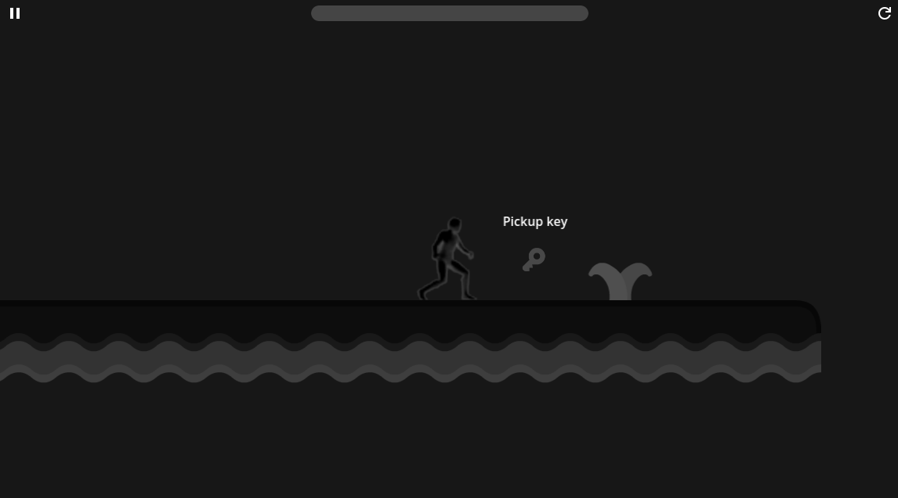

# Platformer
A simple 2D platformer game made in Godot

## Screenshots

    

## Features
- Levels made using tilemaps
- Player energy/stamina system
- Pickup collectibles

# Credits
- Player character https://opengameart.org/content/platformer-animations
- Tilemaps https://kenney.nl/assets/abstract-platformer
